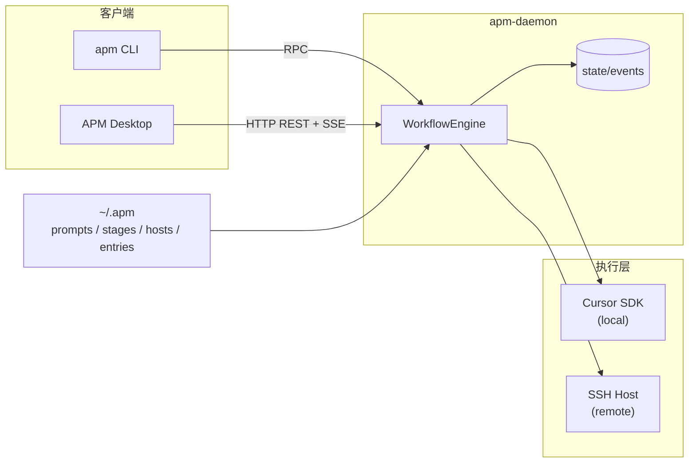

# APM (Agent Pipline Manager)

用几个 Markdown 目录描述多阶段 Agent 工作流，交给常驻 daemon 按图执行——这就是 APM 做的事。底层跑的是 Cursor SDK（`@cursor/sdk`），本地开发用 `tsx` 直接跑源码；要分发给别人时再打 SEA 单文件二进制；不想碰终端的话，还有可选的 Desktop 界面。

---

## 目录

- [Quick Start](#quick-start)
- [架构概览](#架构概览)
- [核心概念](#核心概念)
- [配置目录 ~/.apm](#配置目录-apm)
- [日常使用](#日常使用)
- [人工介入（Attach）](#人工介入attach)
- [Prompt Skills](#prompt-skills)
- [桌面应用（可选）](#桌面应用可选)
- [构建单文件二进制（进阶）](#构建单文件二进制进阶)
- [相关文档](#相关文档)

---

## Quick Start

**前提：** Node 22+，以及有效的 Cursor API Key。

### 1. 安装并编译

```bash
git clone <repo-url> && cd agent_pipline
npm install
npm run build
```

### 2. 准备配置

daemon 首次启动会在 `~/.apm` 下初始化目录。把仓库里的最小示例拷过去即可跑通 demo：

```bash
cp -r examples/minimal/{prompts,stages,hosts,entries} ~/.apm/
```

在 `~/.apm/config.json` 里填入 API Key（文件不存在就新建）：

```json
{
  "cursorApiKey": "cursor_xxx"
}
```

也可通过环境变量 `APM_HOME` 换配置根目录，默认是 `~/.apm`。

### 3. 启动 daemon，提交一次 run

开两个终端。**终端 1** 先起 daemon——CLI 所有操作都依赖它：

```bash
npm run dev:daemon
```

**终端 2** 提交 demo 工作流，`-p` 注入变量 `task`：

```bash
npm run dev:cli -- run demo -p task=整理代码结构
```

默认前台跑，日志会持续刷到终端，跑完自动退出。看到 agent 输出就说明链路通了。

---

## 架构概览

APM 把「配置解析 + 调度执行」放在 **apm-daemon** 里，**apm** CLI 只负责发指令、看日志、进 attach TUI。配置全部在 `~/.apm` 下，以 Markdown 文件描述工作流图。




几个要点：

- **daemon 常驻**：`run`、`ps`、`logs`、`attach` 都通过它完成；CLI 本身不嵌 SDK。
- **结构化日志**：每次 run 的事件写入 `~/.apm/state/events/`，JSONL 格式，含 SDK tool_call，可用 `apm logs` 过滤查看。
- **远程执行**：`hosts/` 里配 SSH 目标，远端需自行安装 `node` 与 `@cursor/sdk`。

---

## 核心概念

工作流由四类 Markdown 目录拼成一张 DAG。仓库 `[examples/minimal/](examples/minimal/)` 是最小可运行示例，下面用它走一遍。

### entries/ — 入口

每个 entry 文件对应一个可 `run` 的名字。frontmatter 指定从哪个 stage 开始、跑在哪台 host、以及默认变量：

```yaml
---
entry: stage_a
host: local
task: 分析当前代码仓库中的待办事项并给出计划
---
# demo

最小可运行示例入口。
```

执行 `apm run demo` 时，APM 读 `entries/demo.md`，从 `stage_a` 起步，在 `local` host 上跑。

### stages/ — 阶段图

每个 stage 文件描述「本阶段跑哪些 prompt」和「完成后去哪」：

```markdown
## 提示词
- brief

## 后继阶段
- parallel_a
- parallel_b
```

`## 提示词` 下列出的 prompt **按顺序串行**执行；`## 后继阶段` 里列 2 个及以上 stage 则**并行**分叉，只有 1 个则**串行**前进。整个工作流就是这样连起来的。

### prompts/ — 单个 Agent

一个 prompt 文件 = 一个 agent 的 system prompt。正文里可以用 `{task}`、`{stage_name.prompt_name}` 等引用前序输出。frontmatter 控制模型和是否加载项目 Skill（见 [Prompt Skills](#prompt-skills)）：

```yaml
---
model: auto
skills: false
---
你是一个精简执行助手。请根据输入目标输出 3 条可执行步骤。

目标：
{task}
```

### hosts/ — 执行环境

指定 agent 跑在哪、工作目录是什么。本地示例：

```yaml
---
host: localhost
workspace: .
virtualEnv: .venv
---
```

SSH 远程 host 也在此配置（`host` / `port` / `username` / `password` 等），详见 [APM_REQUIREMENTS.md](APM_REQUIREMENTS.md)。

---

## 配置目录 ~/.apm

daemon 启动时会自动创建缺失的目录和状态文件：

```text
~/.apm/
  prompts/          # Agent 提示词
  stages/           # 阶段定义（DAG 边）
  hosts/            # 执行主机
  entries/          # 工作流入口
  state/
    runs.json       # run 索引
    events/         # JSONL 事件日志
    http.token      # HTTP API token（启用后生成）
  config.json       # API Key、HTTP 端口等
```

`config.json` 常用字段：

```json
{
  "cursorApiKey": "cursor_xxx",
  "http": {
    "enabled": true,
    "port": 19740
  }
}
```

---

## 日常使用

下面所有命令都有两种跑法：**开发模式**（改代码后即时生效）和**二进制模式**（SEA 打包产物）。二选一即可。

### 启动 daemon


|                   | 命令                                |
| ----------------- | --------------------------------- |
| 开发模式              | `npm run dev:daemon`              |
| 二进制（Linux x64 示例） | `./dist/bin/apm-daemon-linux-x64` |


> SEA 版 `apm` CLI **不含** Cursor SDK，daemon 请用 `apm-daemon` 二进制启动；`apm daemon` 会提示你改用 apm-daemon。

### 提交 run

```bash
# 开发模式 — 前台跟随日志，跑完退出
npm run dev:cli -- run demo -p task=整理代码结构

# 开发模式 — 后台提交，立即返回 run id
npm run dev:cli -- run demo -d -p task=整理代码结构

# 开发模式 — 启动后直接进入 attach TUI（human-in-the-loop）
npm run dev:cli -- run demo -a -p task=整理代码结构
```

二进制等效（Linux x64）：

```bash
./dist/bin/apm-linux-x64 run demo -p task=整理代码结构
./dist/bin/apm-linux-x64 run demo -d -p task=整理代码结构
./dist/bin/apm-linux-x64 run demo -a -p task=整理代码结构
```

`-a/--attach` 与 `-d/--detach` 互斥。attach TUI 里 `:quit` 退出后，工作流在 daemon 后台继续跑，**不再**暂停等 `:next`。

### 查看 run 与日志

```bash
npm run dev:cli -- ps
npm run dev:cli -- logs <runId>
npm run dev:cli -- logs <runId> --json       # JSONL 原样输出
npm run dev:cli -- logs <runId> --follow     # 持续跟踪
npm run dev:cli -- logs <runId> --kind tool  # 只看 tool 事件
```

---

## 人工介入（Attach）

需要中途看 agent 在干什么、发消息、或手动决定「什么时候进下一阶段」，用 attach：

```bash
npm run dev:cli -- attach <runId>
```

也可以在 `run` 时加 `-a` 直接进入。TUI 内支持的命令：


| 命令                             | 作用                     |
| ------------------------------ | ---------------------- |
| `:help`                        | 显示帮助                   |
| `:stage <stage_name>`          | 切换查看的阶段                |
| `:prompt <prompt_name>`        | 切换查看的 prompt           |
| `:tools`                       | 切换为仅 tool 事件视图         |
| `:msg <prompt_name> <message>` | 向指定 prompt 的 agent 发消息 |
| `:next`                        | 手动推进到下一阶段              |
| `:quit`                        | 退出 attach（工作流继续在后台跑）   |


attach 激活时，每个并行批次跑完后会**统一暂停**，等你输入 `:next` 才进入下一批后继 stage。适合需要人工把关的多 agent 流水线。

---

## Prompt Skills

默认情况下 agent 用最小配置启动。如果某个 prompt 需要读取项目里的 Cursor Skill、rules、MCP 等，在 frontmatter 打开 `skills`：

```yaml
---
model: auto
skills: true
---
```

这会加载目标 workspace 下的 `.cursor/skills/` 等项目级配置。省略或设为 `false` 则保持默认的最小 Agent 配置。

---

## 桌面应用（可选）

CLI + attach TUI 够用时可以跳过这节。APM Desktop 是基于 **Tauri 2 + React** 的图形界面（类似 Docker Desktop），提供 daemon 启停、run 列表、日志 SSE、Attach/HITL，以及 `~/.apm` 配置编辑。

**前置条件：** Node 22+、Rust toolchain（`cargo` / `rustc`），Linux 桌面还需 `webkit2gtk` 等 Tauri 系统依赖。

### 开发模式

1. 在 `~/.apm/config.json` 启用 HTTP API（`"http": { "enabled": true, "port": 19740 }`），或之后通过桌面「设置」保存。
2. **终端 1** 启动 daemon，记下日志里的 `apm http api http://127.0.0.1:19740` 和 token 文件路径：
  ```bash
   npm run dev:daemon
   cat ~/.apm/state/http.token
  ```
3. **终端 2** 启动桌面前端（`APM_DESKTOP_DEV=1` 表示连接已有 daemon，不自动 spawn sidecar）：
  ```bash
   export APM_DESKTOP_DEV=1
   export APM_HTTP_URL=http://127.0.0.1:19740
   export APM_HTTP_TOKEN=$(cat ~/.apm/state/http.token)
   npm run desktop:install
   npm run desktop:dev
  ```

### 构建安装包

```bash
npm run build:bin
# 将 dist/bin/apm-daemon-<platform> 复制为 apps/apm-desktop/src-tauri/bin/apm-daemon-<target-triple>
npm run desktop:build
```

---

## 构建单文件二进制（进阶）

日常开发用 `npm run dev:daemon` 就够了，不必每次重建。需要把 APM 分发给没有 Node 环境的机器时，才走 SEA 打包流程。

APM 用 **esbuild 预打包 + Node SEA** 产出单文件二进制，输出到 `dist/bin/`。构建要求 **Node 22+**（Node 20 会回退到 `postject` 流程）。

**构建链路：** `tsc` → 收集原生 assets（`rg` / `cursorsandbox` / `sqlite3.node`）→ esbuild bundle → SEA 注入。清单写入 `dist/bin/manifest.json`。

### 目标平台


| Target         | 产物                                             |
| -------------- | ---------------------------------------------- |
| `linux-x64`    | `apm-linux-x64`、`apm-daemon-linux-x64`         |
| `linux-arm64`  | `apm-linux-arm64`、`apm-daemon-linux-arm64`     |
| `darwin-x64`   | `apm-darwin-x64`、`apm-daemon-darwin-x64`       |
| `darwin-arm64` | `apm-darwin-arm64`、`apm-daemon-darwin-arm64`   |
| `win32-x64`    | `apm-win32-x64.exe`、`apm-daemon-win32-x64.exe` |


跨平台产物需在对应 OS/arch 上分别构建（CI 矩阵），`build:bin:all` 在单机上只会成功打出当前平台。

### 构建命令

```bash
npm run build:bin          # 仅当前平台
npm run build:bin:all      # 全部 target（需各平台 runner）
npm run build:release      # JS + 当前平台 SEA 二进制
```

### 冒烟验证

```bash
npm run smoke:bin          # 验证 --help、daemon 启动、最小 run/ps 链路
npm run smoke:sea          # 需要 CURSOR_API_KEY，验证 SEA daemon 跑通 test_local
```

`smoke:sea` 前设置：

```bash
export CURSOR_API_KEY="cursor_..."
```

### 运行时行为与注意事项

- **apm-daemon** 首次启动会把 SEA assets 解压到 `~/.apm/runtime/<platform-arch>/`（含 `rg`、`cursorsandbox`、`sqlite3.node`）。
- **apm** CLI 二进制不含 Cursor SDK；daemon 务必用 **apm-daemon** 二进制。
- `@cursor/sdk` 依赖平台原生 binding；构建前在本机执行 `npm ci`，确保 optionalDependencies 完整。
- SSH 能力通过 `ssh2` 打入 apm-daemon bundle；远程 host 仍需独立安装 `node` 与 `@cursor/sdk`。

---

## 相关文档

- [APM_REQUIREMENTS.md](APM_REQUIREMENTS.md) — 完整目录规范、变量引用语法、HITL 语义
- [examples/minimal/](examples/minimal/) — 最小可运行工作流，Quick Start 可直接复制

